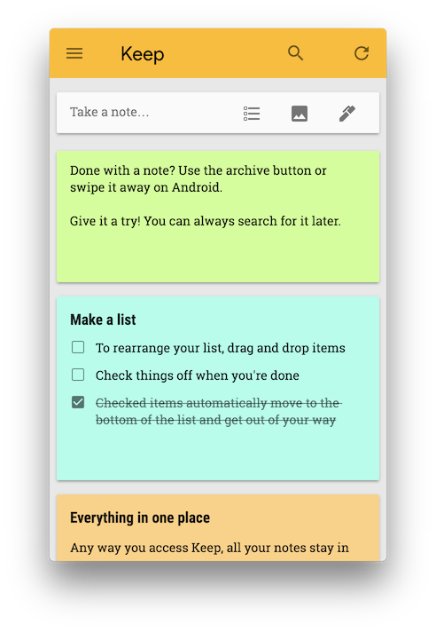

# keep
> Simple Google Keep menu bar application built in Electron.



## Download
The latest binaries can be found [here](https://github.com/tmcinerney/keep/releases).

### Homebrew Cask
Assuming you have `brew` (https://brew.sh) and `brew cask` (https://caskroom.github.io) installed and working:

```sh
brew cask install keep
```

## Install
```sh
git clone https://github.com/tmcinerney/keep
cd keep
npm install
```

## Run
```sh
npm run start
```

## Build
```sh
npm run build
```
